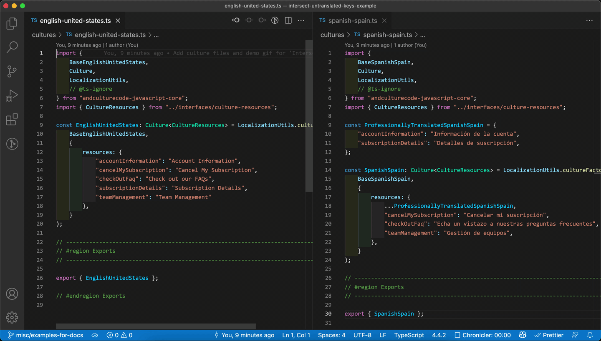

# Commands > Intersect untranslated keys

## Overview

Generate a CSV with keys and English translations based on a culture file to send off for professional translation.

## Demo

<!--  -->

## Notes

-   Only non-English culture files will be displayed in the selection prompt.
-   Untranslated or placeholder translations are keys that exist in the inline `resources` object during the `LocalizationUtils.cultureFactory` call, for example:

<!-- prettier-ignore -->
```ts
const ProfessionallyTranslatedSpanishSpain = {
    "aboutApp": "Acerca de {{appName}}",
    "acceptGroupInvitation-invitedByNameToJoin": "{{byName}} te invitó {{toJoin}}",
    "acceptGroupInvitation-invitedToJoin": "Has sido invitado {{toJoin}}",
};

const SpanishSpain: Culture<CultureResources> = LocalizationUtils.cultureFactory<CultureResources>(
    BaseSpanishSpain,
    {
        resources: {
            ...ProfessionallyTranslatedSpanishSpain,
            "addTo": "Añadir a {{container}}",
            "admin": "Administración",
            "all": "todas",
        },
    }
);
```

-   The CSV file that is opened in VS Code is not initially saved anywhere. You can copy/paste this into Excel manually, or save the file and give it a name/location as usual.

## Related settings

-   The culture files are determined by the path(s) or glob pattern(s) specified in the extension's [settings](../settings/culture-file-paths).
